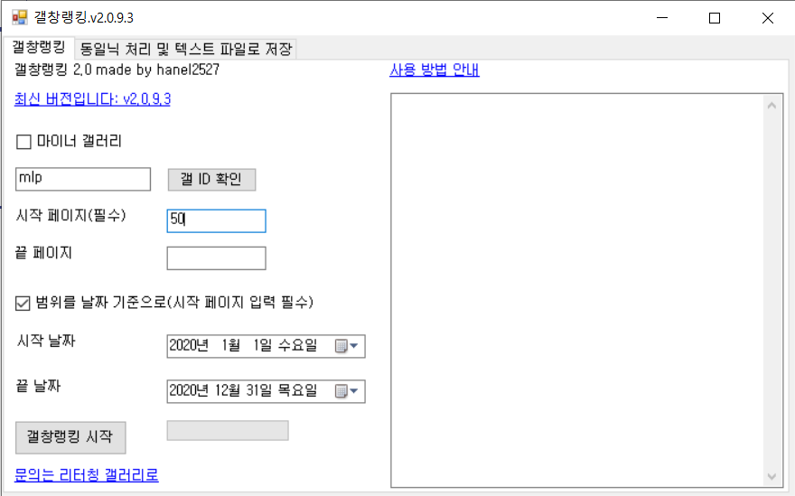
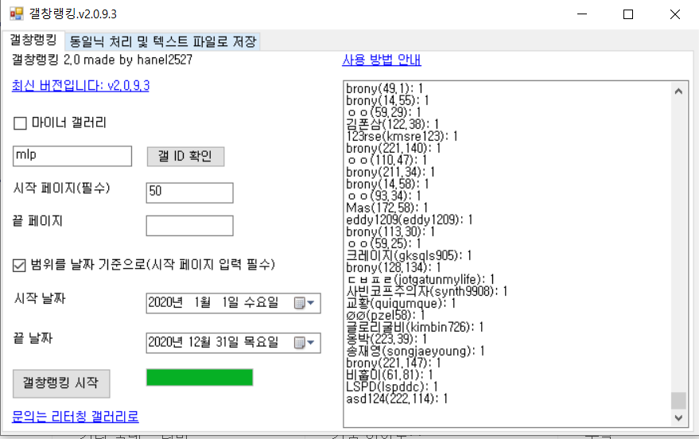
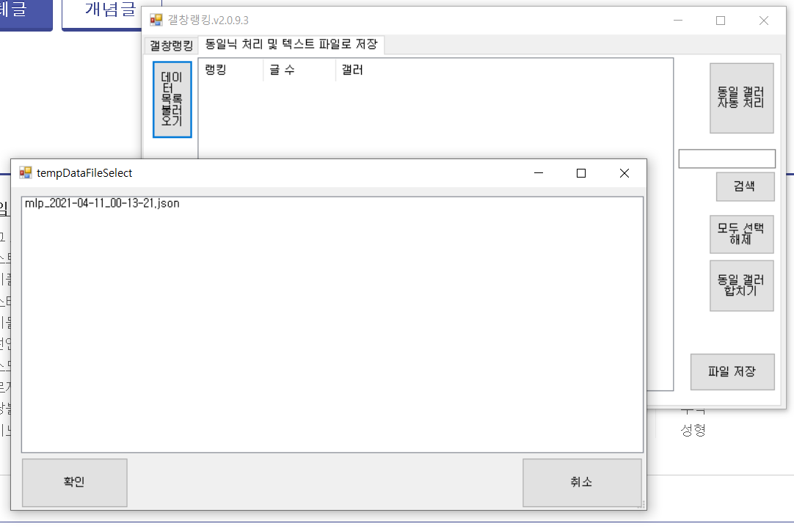
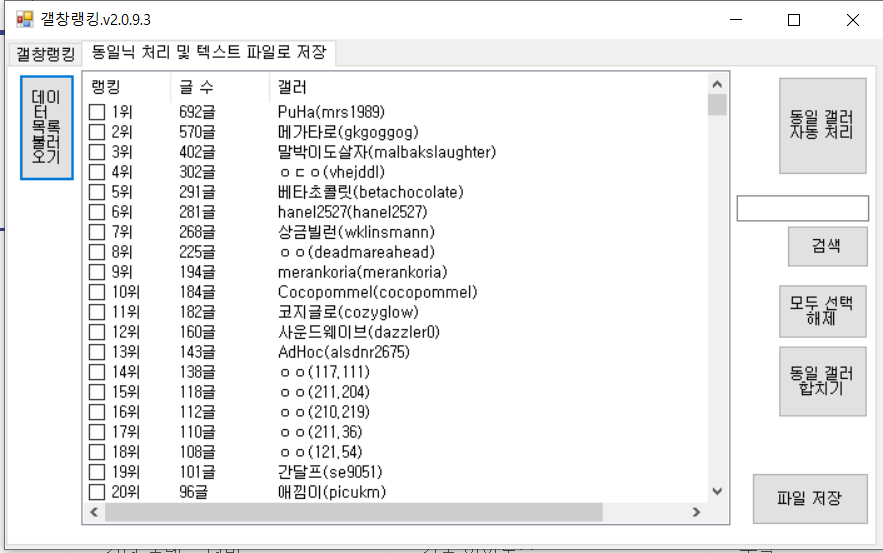
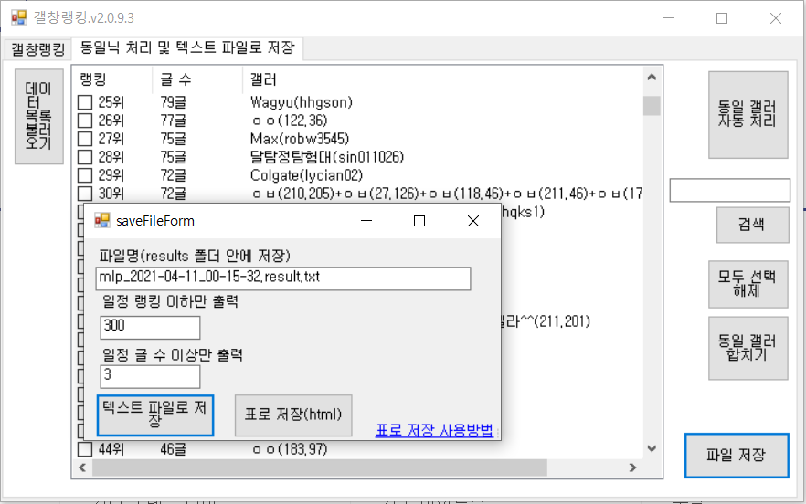
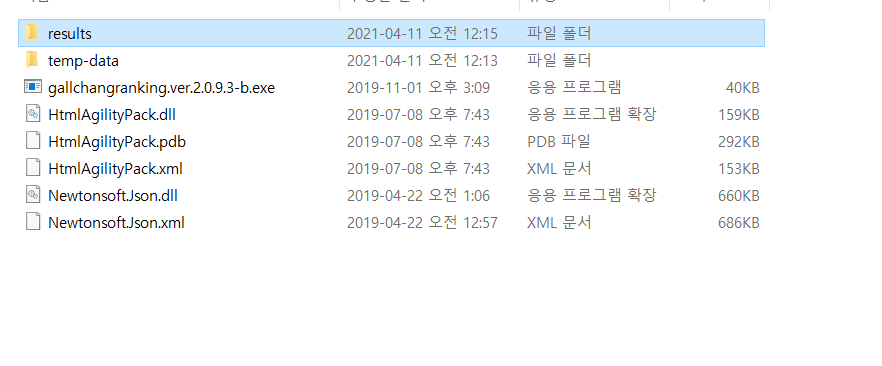
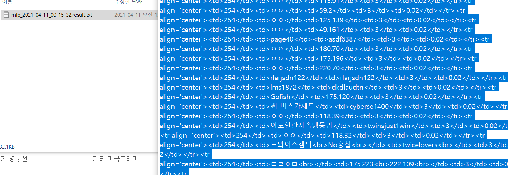
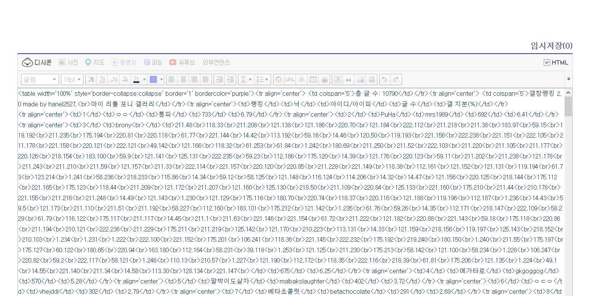
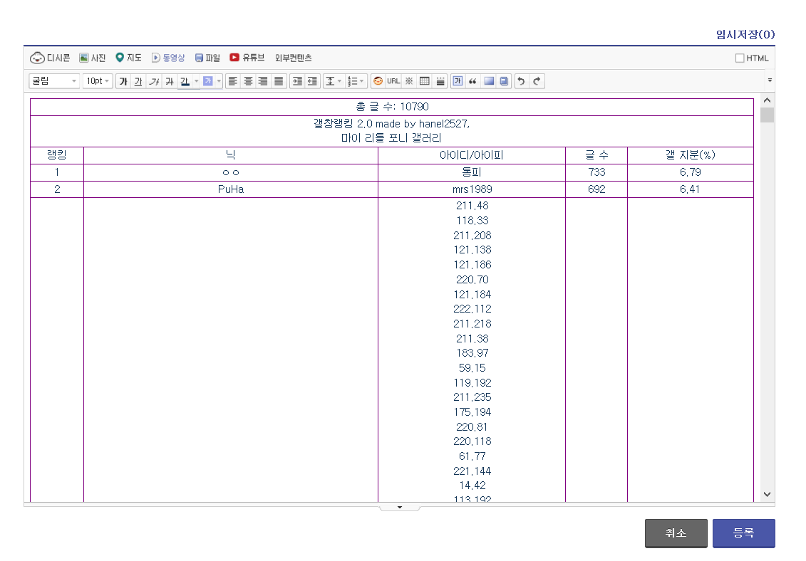

# 갤창랭킹 2.0 made by hanel2527

갤창랭킹 프로그램 다운로드, 잉여랭킹, 디씨랭킹, 디시랭킹, 디시인사이드

기본 갤창랭킹을 C#을 이용해 다시 만든 버전입니다.

.NET FRAMEWORK 4.6.1

외부 라이브러리: HtmlAgilityPack, Json.NET

## 다운로드 [갤창랭킹.v2.0.9.3](https://github.com/hanel2527/dcinisde-crawler.ver.2/releases)

- GUI 적용(Windows Forms)

- 날짜 기준으로 크롤링

- 같은 글 중복 카운팅 방지

- 통피 ㅇㅇ, 같은 닉 유동 및 같은 아이디 고닉 자동 합치기

- 표로 저장 기능 추가

## 사용법

1. 갤 ID 입력: https://gall.dcinside.com/board/lists?id=mlp 에서 mlp

2. 시작 페이지 입력

3. 날짜 기준으로 할 경우 날짜 입력

4. 갤창랭킹 시작

5. 갤창랭킹 완료

6. 동일닉 처리 및 텍스트 파일로 저장

7. 데이터 목록 불러오기

8. 데이터 선택 (갤id_연월일_시분초.json)

9. 동일 갤러 자동 처리(동일 고닉, 유동 자동 합치기)

10. 자동 처리 되지 않은 고닉은 체크 -> 동일 갤러 합치기 누르면 합쳐짐

11. 파일 저장

* 텍스트 파일로 저장: 그냥 텍스트 파일

* 표로 저장: html 테이블로 저장

12. 파일은 results 폴더 안에 있음

13. 표로 저장했을 경우 -> 복붙 -> 글쓰기 -> 오른쪽 위 HTML 체크 -> 붙여넣기

14. HTML 체크 해제시 표가 보임